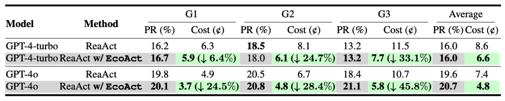
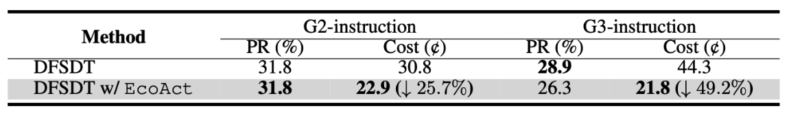

# EcoAct: Economic Agent Determines When to Register What action

## Introduction 

This repository is the implementation of EcoAct: Economic Agent Determines When to Register What action.
This version of the code is made to facilitate the peer review of the ICLR 2025 submission of our paper. We plan to release the code accompanying the formal publication of this paper.

## Datasets

We mainly conduct experiments on the ToolBench[1], which is large-scale dataset for tool use. It involves 16,464 tools in total which has been widely used as the benchmark to make evaluations of tool use algorithm[2]. Please download and deploy the dataset through their official github repo (https://github.com/OpenBMB/ToolBench). 

## Requirements

**1. To install requirements:** 

```
pip install -r requirements.txt
```
**2. Specify OpenAI key and ToolBench in config.py.**


## How to Run

Take running gpt-4o on G1_tool as an example. The backbone_model name must be the same as the key in config.py.

**1. Run EcoAct with ReAct**

```
python toolbench/inference/qa_pipeline.py    --backbone_model gpt4o  --method efficient   --input_query_file /your_path_to/G1_instruction
```

**2. Run EcoAct with DFSDT**

```
python toolbench/inference/qa_pipeline.py    --backbone_model gpt4o  --method effDFS   --input_query_file /your_path_to/G1_instruction
```

**3. Conver inference result**

```
python convert_to_answer_format.py --answer_dir /your_path_to_inference_result/G1_instruction
```

**4. Making evaluation for pass rate**

Specify OpenAI key for evaluation in toolbench/tooleval/config.py.

```
python eval_pass_rate_anytool.py --converted_answer_path path_to_your_converted_inference_result/G1_instruction
```


**5. Compute cost**

First, specify the inference result in caculate_toolbench.py.
Then,

```
python caculate_toolbench.py
```


## Main Empirical Results






## Reference

[1] Qin, Y., Liang, S., Ye, Y., Zhu, K., Yan, L., Lu, Y., ... & Sun, M. (2023). Toolllm: Facilitating large language models to master 16000+ real-world apis. arXiv preprint arXiv:2307.16789.

[2] Du, Y., Wei, F., & Zhang, H. (2024). Anytool: Self-reflective, hierarchical agents for large-scale api calls. arXiv preprint arXiv:2402.04253.